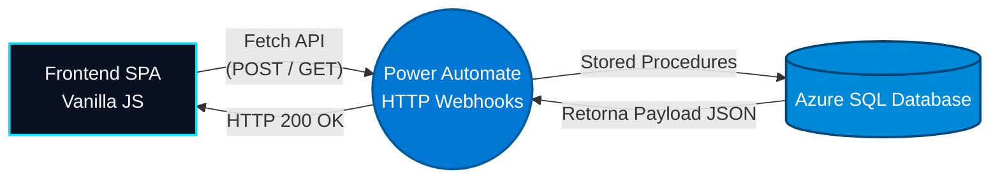

<h1 align="center">
  <br>
  Personal JobTracker 🎯
  <br>
</h1>

<h4 align="center">Uma aplicação Full-Stack serverless corporativa para gestão estratégica de candidaturas e processos seletivos.</h4>

<p align="center">
  
  
  
  
</p>

<p align="center">
  <a href="#-sobre-o-projeto">Sobre</a> •
  <a href="#-arquitetura">Arquitetura</a> •
  <a href="#-features">Features</a> •
  <a href="#-tecnologias">Tecnologias</a> •
  <a href="#-modelagem-de-dados">Modelagem</a> •
  <a href="#-como-executar">Como Executar</a>
</p>

---

## 💡 Sobre o Projeto

O **Personal JobTracker** nasceu da necessidade de gerenciar o alto volume de aplicações em vagas de tecnologia de forma estruturada, saindo de planilhas convencionais para uma solução **API-First**. 

Projetado com princípios de **Clean Code** e **Separation of Concerns**, o sistema possui uma interface responsiva focada em UX (Glassmorphism e Dark Theme), enquanto o back-end roda de forma 100% serverless, utilizando gatilhos HTTP do Power Automate como API Gateway para interagir com procedures no Azure SQL.

## 🏗️ Arquitetura

O ecossistema foi construído visando baixo custo de manutenção, alta disponibilidade e segurança, separando a camada de apresentação da regra de negócio.



## ✨ Features

- **Padrão SPA (Single Page Application):** Navegação fluida via abas entre o formulário de cadastro e a dashboard de acompanhamento, sem recarregar a página.
- **Governança de Dados Front-End:**
  - Sistema de paginação assíncrona (Client-side) configurado para 9 cards por view, garantindo estabilidade de memória para centenas de registros.
  - Filtros dinâmicos cruzados: Busca por *Nome da Empresa* (Text-match) e *Status do Processo* (Dropdown).
- **Operações CRUD Assíncronas:**
  - **Create:** Cadastro de nova vaga com validação severa de DOM (Required Fields).
  - **Read:** Sincronização em tempo real de vagas cadastradas exibidas em Cards interativos.
  - **Update:** Mudança de etapa do processo seletivo via requisição `PATCH/POST` acionada diretamente de dentro do Card.
- **UI/UX Premium:** Design imersivo corporativo, suporte a Dark/Light Mode contínuo, e plano de fundo tático interativo renderizado nativamente em SVG (Radar Tecnológico de SP).

## 🚀 Tecnologias

- **Front-End:** HTML5 Semântico, CSS3 (CSS Grid, Flexbox, Variáveis nativas, Animações e Glassmorphism), e JavaScript Vanilla (ES6+, Async/Await, Fetch API).
- **Middleware:** Microsoft Power Automate (Fluxos de Nuvem com Triggers HTTP Request/Response).
- **Back-End/Banco de Dados:** Microsoft Azure SQL Database.
- **Linguagem de Banco:** T-SQL (Stored Procedures com controle de transação, funções condicionais e captura de `SCOPE_IDENTITY()`).

## 🗄️ Modelagem de Dados

O banco foi estruturado utilizando o modelo multidimensional (Star Schema) para facilitar futuras integrações com softwares de BI (Power BI, Metabase).
- **Fato_Candidaturas:** Armazena as métricas do processo (Pretensão Salarial, Data, ID_Status, etc).
- **Dimensões:** `Dim_Empresa` (com lógica SCD Tipo 1 via Stored Procedure para Upsert automático), `Dim_Status`, `Dim_Plataforma`, etc.

## 🛠️ Como Executar

Por ser uma aplicação baseada em Cloud (Serverless), o back-end está hospedado no Azure. Para rodar a camada de visualização localmente:

1. Clone o repositório:
```bash
git clone https://github.com/SeuUsuario/personal-jobtracker.git
```
2. Abra a pasta do projeto.
3. Como os arquivos estão desacoplados (`index.html`, `style.css` e `app.js`), você pode abrir o `index.html` diretamente no seu navegador, ou utilizar uma extensão como o *Live Server* no VS Code.
4. Para realizar o Deploy da interface, basta conectar o repositório ao **Azure Static Web Apps**.

---

<p align="center">
  <b>Desenvolvido por Gabriel Vieira</b><br>
  <i>Gestão de Dados e Engenharia de Software</i>
</p>
