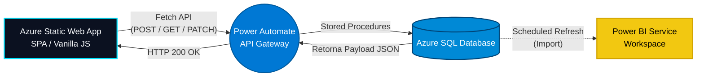

<h1 align="center">
   
  Personal JobTracker 🎯
   
</h1>

<h4 align="center">Uma aplicação Full-Stack corporativa para gestão estratégica de candidaturas, rodando 100% Serverless no ecossistema Azure.</h4>

  
  
  
  
  

<h3 align="center">
  🌐 <a href="https://wonderful-flower-098d5d30f.1.azurestaticapps.net/">Acessar o Sistema ao Vivo</a> 🌐
</h3>

---

## 🎯 Resumo Executivo

O **Personal JobTracker** é uma solução de engenharia de dados *End-to-End* criada para modernizar e metrificar a jornada de busca por emprego. Substituindo planilhas manuais, o sistema oferece uma interface web interativa conectada a um banco de dados em nuvem, orquestração de APIs e um motor de Business Intelligence.

O objetivo do repositório é demonstrar domínio arquitetural completo: desde a captura do dado no Front-End, sua transição segura via Middleware, modelagem do armazenamento relacional e, por fim, seu consumo analítico.

---

## 💻 Guia de Uso e Funcionalidades (As Telas)

O sistema foi desenhado sob o padrão **SPA (Single Page Application)**. A navegação entre as telas ocorre instantaneamente através da manipulação do DOM pelo JavaScript, sem recarregamento da página. 

### 1️⃣ Tela: Nova Candidatura (Data Entry)
A porta de entrada do dado. Formulário validado focado em UX (Dark/Light mode e Glassmorphism).
- **Governança de Dados (Front-End):** O formulário aplica regras de negócio no momento do input. Status terminais (como "Proposta" ou "Rejeitado") não existem no ato de cadastro para evitar dados "nascendo mortos" no banco.
- **Integração Async:** Ao salvar, o JS monta um JSON e aciona a Fetch API (método `POST`), comunicando-se com o Webhook na nuvem.

<!-- ========================================== -->
<!-- 📸 IMAGEM 1: TELA DO FORMULÁRIO -->
<!-- ========================================== -->

  

### 2️⃣ Tela: Processos Ativos (Gestão e CRUD)
O painel de controle operacional onde a mágica acontece.
- **Renderização Dinâmica em Grid:** Ao abrir a aba, o sistema dispara um `GET`, recebe todo o histórico do banco de dados e desenha *Cards* interativos dinamicamente na tela usando CSS Grid.
- **Filtros Client-Side Assíncronos:** O usuário pode pesquisar pelo nome da empresa (*Text-match dinâmico*) ou filtrar por status no dropdown. Todo o filtro roda na memória do navegador utilizando métodos de `Array.filter()`, garantindo resposta em milissegundos sem bater no banco de dados desnecessariamente.
- **Patch/Update de Status:** Quando o candidato avança de fase, basta o usuário clicar em um card ativo para atualizar o seu status (acionando a rota `PATCH` no backend).

<!-- ========================================== -->
<!-- 📸 IMAGEM 2: TELA DE PROCESSOS ATIVOS -->
<!-- ========================================== -->

  

### 3️⃣ Tela: Dashboard (Embedded Analytics)
Visão executiva integrada nativamente dentro da aplicação.
- **Imersão Nativa (UI/UX):** O dashboard é injetado via `iFrame`. Utilizando técnicas avançadas de CSS (*Overflow hidden* e *Breakout Layout* `95vw`), as barras e logotipos padrão do Power BI Service são cortados e ocultados, fazendo o relatório parecer um elemento codificado de forma nativa na aplicação.

<!-- ========================================== -->
<!-- 📸 IMAGEM 3: TELA DO DASHBOARD POWER BI -->
<!-- ========================================== -->

  

---

## 🗄️ Modelagem de Dados (Star Schema e DER)

O coração técnico desta aplicação reside na estruturação rigorosa do banco de dados **Azure SQL Database**. Para garantir tanto a integridade das transações do sistema web quanto a performance analítica extrema para o Power BI, foi adotada a arquitetura de **Modelo Estrela (Star Schema)**.

<!-- ========================================== -->
<!-- 📸 IMAGEM 4: FOTO DO SEU DER (DIAGRAMA) -->
<!-- ========================================== -->

  

- **A Tabela Fato (`Fato_Candidaturas`):** Atua como o registro imutável e magnético dos eventos. Ela documenta a granularidade máxima das transações corporativas. Toda vez que uma candidatura é salva ou um status muda, um novo registro histórico é gerado. Ela armazena métricas puras, carimbos temporais (*timestamps*) e as chaves estrangeiras (FKs) garantindo rastreabilidade e controle de SCD (Slowly Changing Dimensions).
- **As Tabelas Dimensão (`Dim_Empresa`, `Dim_Status`, `Dim_Vaga`):** Normalizadas para abstrair todo o contexto descritivo. Em vez de registrar o texto "Tecnologia" milhares de vezes na tabela fato, gravamos apenas seu respectivo ID. Isso reduz drasticamente os custos de armazenamento no *Azure Cloud* e acelera pesadamente as operações de busca (*Scans*).
- **Propagação e Cardinalidade (1:*):** A arquitetura foi desenhada priorizando a integridade referencial (*Foreign Key Constraints*). Quando o modelo semântico do Power BI absorve as tabelas, o filtro flui magicamente do lado (1) das dimensões para o lado (*) da fato, processando agregações complexas instantaneamente.

---

## 🚀 Arquitetura e Stack Tecnológica (Deep Dive)

Para tech leads e engenheiros, abaixo detalhamos o fluxo arquitetural e o *porquê* de cada tecnologia escolhida.

### 1. Front-End: Clean Code e Sem Frameworks
- **Tecnologias:** HTML5 Semântico, CSS3 (Variáveis CSS, Flexbox, Grid), Vanilla JavaScript (ES6+).
- **Decisão Técnica:** Escolher Vanilla JS ao invés de React/Vue demonstra forte conhecimento dos fundamentos da web (Manipulação real de DOM, escopo léxico, Event Listeners e Promises) garantindo uma carga (*bundle*) extremamente leve e altíssima performance.

### 2. DevOps e Hospedagem: CI/CD com Azure
- **Tecnologias:** Azure Static Web Apps, GitHub Actions.
- **Decisão Técnica:** A aplicação sobe automaticamente para nuvem a cada `commit` feito no branch principal. Isso evidencia domínio sobre integração contínua (CI/CD) e orquestração de deploys enterprise zero-downtime.

### 3. Middleware: API Gateway Serverless
- **Tecnologias:** Microsoft Power Automate (Fluxos da Nuvem HTTP).
- **Decisão Técnica:** Ao invés de expor credenciais de banco no front, criamos rotas HTTP (Webhooks) no Power Automate. Ele recebe os JSONs do front-end, valida chaves e encapsula a chamada ao banco de dados atuando de forma 100% *Serverless*.

### 4. Banco de Dados e Engenharia
- **Tecnologias:** Azure SQL Database (T-SQL).
- **Decisão Técnica:** Banco de dados seguro estruturado sob arquitetura transacional e analítica. Toda a lógica de inserção ocorre de forma protegida dentro de *Stored Procedures* utilizando comandos seguros de transação (`BEGIN TRAN`) e `SCOPE_IDENTITY()`.

### 5. Analytics e Camada Semântica
- **Tecnologias:** Power BI Service, Power Query M, DAX.
- **Decisão Técnica:** Orquestração autônoma via *Scheduled Refresh* diário. Destaque total para a manipulação da `Dim_Calendario` no motor DAX (`CALENDARAUTO()`), absorvendo elasticamente as janelas temporais da fato sem consumir recursos do banco de dados relacional. Foco executivo na análise do *Drop-off rate* de candidatos por etapa do funil.

---

  <b>Desenvolvido por Gabriel Vieira</b> 
  <i>Gestão, Arquitetura, Engenharia e Análise de Dados</i>

