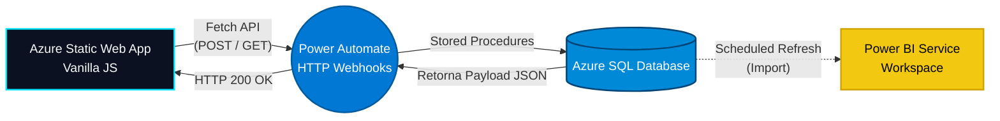

<h1 align="center">
   
  Personal JobTracker 🎯
   
</h1>

<h4 align="center">Uma aplicação Full-Stack corporativa para gestão estratégica de candidaturas, rodando 100% Serverless no Azure.</h4>

  
  
  
  
  

<h3 align="center">
  🌐 <a href="https://wonderful-flower-098d5d30f.1.azurestaticapps.net/">Acessar o Web App Ao Vivo</a> &nbsp;|&nbsp; 📊 <a href="https://app.powerbi.com/view?r=eyJrIjoiZjVhZWNiYmEtMzk0Ni00Y2NkLTk0YjgtNmFiY2I4NGQwZmVmIiwidCI6IjM4YjNlOTY0LWZhNzItNDhjZC05MTk5LTI1ZTJkODQzYjMzNiJ9">Acessar o Dashboard Power BI</a>
</h3>

<!-- ========================================== -->
<!-- 📸 IMAGEM 1: COLOQUE A FOTO DA TELA INICIAL (FORMULÁRIO) NESTE LINK ABAIXO -->
<!-- ========================================== -->

  

  <a href="#-sobre-o-projeto">Sobre</a> •
  <a href="#-arquitetura-e-deploy">Arquitetura & Deploy</a> •
  <a href="#-features-do-web-app">Features</a> •
  <a href="#-camada-semântica-e-analytics-power-bi">Power BI</a> •
  <a href="#-tecnologias">Tecnologias</a>

---

## 💡 Sobre o Projeto

O **Personal JobTracker** nasceu da necessidade de gerenciar o alto volume de aplicações em vagas de tecnologia de forma estruturada. Saindo de planilhas convencionais, o projeto evoluiu para uma solução **API-First** guiada a dados. 

O sistema possui uma interface focada em UX (Glassmorphism e Dark/Light Theme nativo) construída sob os princípios de **Clean Code**. Todo o ecossistema roda de forma **100% Serverless** na nuvem da Microsoft (Azure), garantindo alta disponibilidade e segurança, culminando em um consumo de dados analítico e robusto através de Business Intelligence.

## 🏗️ Arquitetura e Deploy (Azure)

A aplicação está hospedada e distribuída globalmente utilizando o **Azure Static Web Apps**. O pipeline de **CI/CD** (Continuous Integration / Continuous Deployment) foi configurado nativamente através de **GitHub Actions**, permitindo que cada novo *commit* feito no repositório recompile e atualize o sistema em produção de forma 100% automática, sem tempo de inatividade (downtime).

## 📊 Camada Semântica e Analytics (Power BI)

O ecossistema atinge sua maturidade analítica através de um modelo semântico de alto rigor técnico, publicado no **Power BI Service**, desenhado para transformar os dados brutos de candidaturas em inteligência e vantagem competitiva. (O arquivo `.pbix` fonte está na pasta `/powerbi`).

- **Conectividade & Orquestração:** Consumo do banco relacional **Azure SQL Database** utilizando o método *Import*. A orquestração dos dados é garantida via *Scheduled Refresh* nativo do Power BI Service, realizando atualizações autônomas diárias sem a necessidade de um gateway local.
- **Modelagem de Dados (Star Schema):** Arquitetura estritamente multidimensional. Os eventos transacionais de mudança de status foram isolados na `Fato_Candidaturas`, cercada por tabelas descritivas normalizadas (`Dim_Empresa`, `Dim_Status`, etc.), garantindo máxima performance de filtragem e integridade dos relacionamentos (1:*).
- **Time Intelligence Computada:** Para desonerar a engine do banco de dados relacional e flexibilizar as análises temporais temporárias, a `Dim_Calendario` foi gerada de forma virtual, puramente via DAX (`CALENDARAUTO()`), absorvendo automaticamente as janelas temporais de início e fim da tabela fato.
- **UI/UX e Storytelling:** Interface imersiva construída sob um *Dark Theme* corporativo. O painel trata as ausências de dados (*Empty States*) de forma fluida e é fortemente ancorado em métricas operacionais de funil: mapeamento de gargalos por etapa (Drop-off Rate), taxa de conversão consolidada e mineração ativa de oportunidades.

<!-- ========================================== -->
<!-- 📸 IMAGEM 2: COLOQUE A FOTO DO SEU DASHBOARD DO POWER BI NESTE LINK ABAIXO -->
<!-- ========================================== -->

  

## ✨ Features do Web App

- **Governança de Dados Front-End:** Regras de negócio restritas (remoção de status terminais do painel de input) e paginação assíncrona (*client-side*) projetada para garantir performance constante mesmo em alta volumetria.
- **Filtros Dinâmicos Cruzados:** Motor de busca assíncrono para filtro por Nome da Empresa (*text-match*) e status do processo (*dropdown*).
- **Operações CRUD via REST:** Inserção, Leitura e Atualização (*Patching*) de status orquestrados dinamicamente pelos webhooks do Power Automate.

<!-- ========================================== -->
<!-- 📸 IMAGEM 3: COLOQUE A FOTO DOS CARDS (PROCESSOS ATIVOS) NESTE LINK ABAIXO -->
<!-- ========================================== -->

  

## 🚀 Tecnologias e Stack

- **Front-End & Hospedagem:** Vanilla JS, CSS3, HTML5 Semântico hospedados em **Azure Static Web Apps** com CI/CD gerido no **GitHub Actions**.
- **Middleware:** Microsoft Power Automate (API Gateway Serverless).
- **Back-End/Database:** Microsoft Azure SQL Database.
- **Linguagem de Banco:** T-SQL (Stored Procedures, controle de transações e função `SCOPE_IDENTITY()`).
- **Analytics & BI:** Microsoft Power BI Service (DAX, Power Query M).

---

  <b>Desenvolvido por Gabriel Vieira</b> 
  <i>Gestão, Análise e Engenharia de Dados</i>

