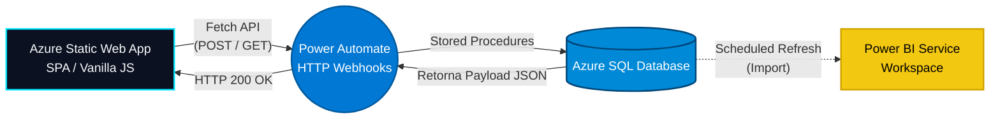

<h1 align="center">
   
  Personal JobTracker 🎯
   
</h1>

<h4 align="center">Uma aplicação Full-Stack corporativa para gestão estratégica de candidaturas, rodando 100% Serverless no Azure.</h4>

  
  
  
  
  

<h3 align="center">
  🌐 <a href="https://wonderful-flower-098d5d30f.1.azurestaticapps.net/">Acessar o Sistema ao Vivo (Live Demo)</a> 🌐
</h3>

---

## 🎯 O Projeto em 1 Minuto (Para Recrutadores)

O **Personal JobTracker** é muito mais que um formulário: é uma solução de dados de ponta a ponta (*End-to-End*) que criei para substituir planilhas comuns na hora de gerenciar meus processos seletivos. 

Ele possui uma interface web elegante (Front-End) que envia dados para um banco de dados na nuvem da Microsoft (Azure SQL) de forma automatizada (via integrações de API). Tudo isso culmina em um painel de Business Intelligence (Power BI) integrado diretamente no site em uma arquitetura de página única (SPA).

### 🕹️ Como testar o sistema agora mesmo:
1. **Acesse o link** do sistema ao vivo no botão acima.
2. Na aba **Nova Candidatura**, preencha os dados simulando uma vaga fictícia e clique em salvar. Seu dado vai trafegar por uma API e será gravado em tempo real no meu banco de dados em nuvem!
3. Alterne para a aba **Processos Ativos** e teste os **filtros de busca**. Você verá os cards com as vagas sendo listados e filtrados instantaneamente na tela.
4. Por fim, acesse a aba **Dashboard** para visualizar o relatório gerencial do Power BI embutido nativamente na aplicação (sem bordas ou menus externos).

<!-- ========================================== -->
<!-- 📸 IMAGEM 1: COLOQUE A FOTO DA TELA INICIAL (FORMULÁRIO) NESTE LINK ABAIXO -->
<!-- ========================================== -->

  

---

## 🏗️ Arquitetura Técnica e Deploy (Azure)

**Para os Engenheiros e Tech Leads:** A aplicação está hospedada e distribuída globalmente utilizando o **Azure Static Web Apps**. O pipeline de **CI/CD** foi configurado nativamente através de **GitHub Actions**, permitindo que cada novo *commit* feito no repositório recompile e atualize o sistema em produção de forma automática, sem tempo de inatividade (downtime).

## 📊 Analytics e Engenharia de Dados (Power BI)

O ecossistema atinge sua maturidade analítica através de um modelo semântico de alto rigor técnico, publicado no **Power BI Service**.

- **Orquestração na Nuvem:** Consumo do banco relacional **Azure SQL** com atualizações autônomas diárias (*Scheduled Refresh*) direto da nuvem, dispensando uso de gateways locais.
- **Modelagem Multidimensional (Star Schema):** Os eventos transacionais foram isolados na tabela Fato (`Fato_Candidaturas`), cercada por dimensões normalizadas, garantindo altíssima performance de processamento.
- **Time Intelligence Otimizado:** A dimensão temporal (`Dim_Calendario`) é calculada dinamicamente na memória via DAX (`CALENDARAUTO()`), aliviando as consultas ao banco relacional.
- **Embedded Analytics (UX):** Dashboard carregado nativamente via HTML iFrame. Através de hacks de CSS e parâmetros de URL, o rodapé padrão da Microsoft foi ocultado para garantir uma imersão 100% fluida, como se fosse um gráfico programado no próprio site.

<!-- ========================================== -->
<!-- 📸 IMAGEM 2: COLOQUE A FOTO DO SEU DASHBOARD DO POWER BI NESTE LINK ABAIXO -->
<!-- ========================================== -->

  

## ✨ Features do Web App

- **Roteamento SPA (Single Page Application):** Alternância instantânea de views (Formulário, Processos e Dashboard) usando controle avançado de DOM via JavaScript, dispensando o recarregamento da página (*Page Reload*).
- **Governança Restrita:** O Front-End previne inserção de dados "sujos", ocultando as etapas de 'Proposta' e 'Rejeitado' do formulário inicial, mas liberando-as para atualização posterior.
- **Filtros Assíncronos Cruzados:** Busca por nome da empresa (*Text Match*) e por status de recrutamento de forma isolada, tudo rodando via JavaScript no próprio navegador do usuário (*Client-side rendering*).

## 🚀 Stack Tecnológica

- **Front-End & Hospedagem:** HTML5, CSS3, Vanilla JS, hospedado no **Azure Static Web Apps** com CI/CD no **GitHub Actions**.
- **Middleware (API Gateway):** Microsoft Power Automate (Workflows Serverless HTTP).
- **Banco de Dados (Relacional):** Microsoft Azure SQL Database.
- **Linguagem de Banco:** T-SQL (Stored Procedures, Controle Transacional e `SCOPE_IDENTITY()`).
- **Data Viz & Analytics:** Microsoft Power BI.

---

  <b>Desenvolvido por Gabriel Vieira</b> 
  <i>Gestão de Dados e Engenharia de Software</i>

